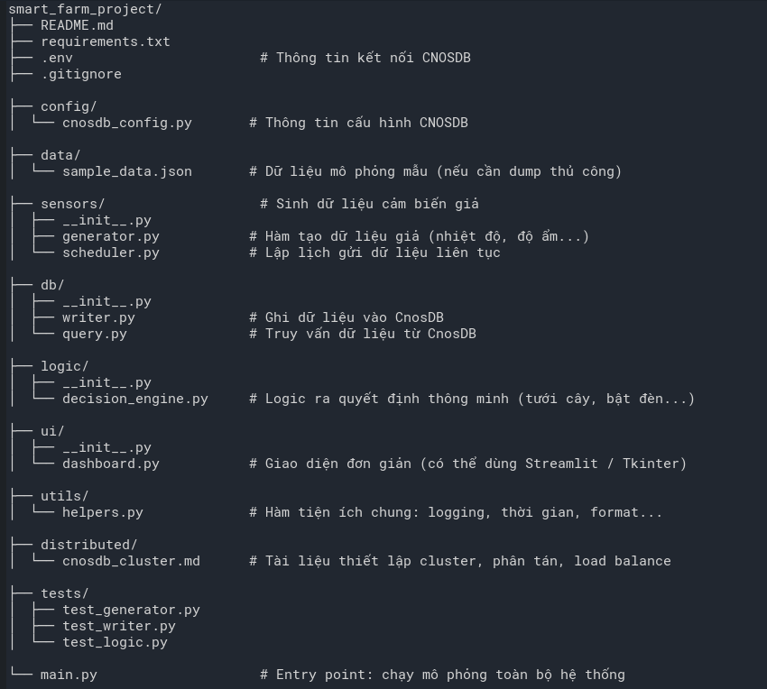

# 🌾 Smart Farming Simulation using CnosDB

Dự án mô phỏng hệ thống nông nghiệp thông minh sử dụng dữ liệu cảm biến giả lập, lưu trữ bằng **CnosDB**, giao diện trực quan và xử lý logic trạng thái tự động.

---

## 🧠 Mục tiêu dự án

- Mô phỏng cảm biến thu thập dữ liệu thời tiết: nhiệt độ, độ ẩm, ánh sáng...
- Ghi và truy vấn dữ liệu từ **CnosDB** (một time-series database hiệu năng cao).
- Giao diện trực quan hiển thị dữ liệu theo thời gian thực.
- Xử lý logic trạng thái giả lập hành vi tự động: tưới nước, đóng/mở đèn...
- Thiết lập hệ thống phân tán và có khả năng cân bằng tải.

---

## ⚙️ Công nghệ sử dụng

| Thành phần | Mô tả |
|------------|------|
| `Python` | Ngôn ngữ lập trình chính |
| `CnosDB` | Time-series Database để lưu dữ liệu cảm biến |
| `Streamlit` | Tạo giao diện trực quan đơn giản |
| `schedule` | Lập lịch sinh dữ liệu tự động |
| `pandas`, `numpy` | Xử lý và thống kê dữ liệu |
| `loguru` | Ghi log dễ đọc |
| `pytest` | Kiểm thử logic |

---

## 🗂️ Cấu trúc thư mục




---

## 🔧 Cài đặt

```bash
git clone https://github.com/Catherine1401/smart_farm.git
cd smart_farm_project
python -m venv venv
source venv/bin/activate      # hoặc .\venv\Scripts\activate trên Windows
pip install -r requirements.txt
```

## Chạy mô phỏng

```bash
python main.py
```

## Mô phỏng dashboard

```bash
streamlit run ui/dashboard.py
```

## Hệ thống phân tán

- Hỗ trợ triển khai cluster CnosDB.
- Tính năng replication và Raft consensus để đảm bảo độ tin cậy.
- Có thể thiết lập Load Balancer để phân tải giữa nhiều node.

Xem chi tiết tại: `distributed/cnosdb_cluster.md`

## Giấy phép

MIT License